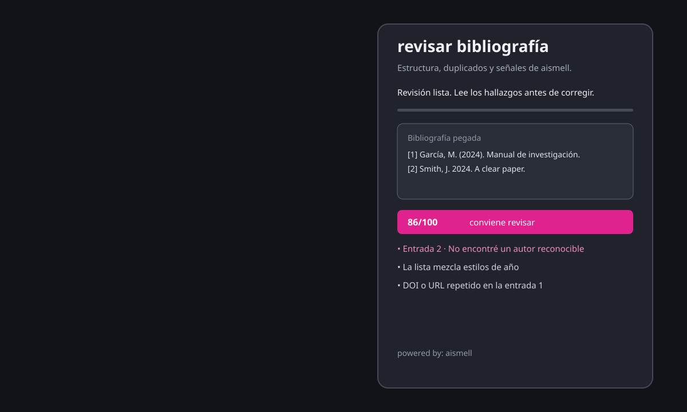

# ai bibliography check

<p align="center">
  <a href="https://www.ko-fi.com/brmcl"></a>
</p>

[English](README.md)



Panel bilingüe de Omarchy / Quickshell para revisar una bibliografía pegada antes de entregarla. Busca autores o años ausentes, DOI/URL duplicados, mezcla de estilos de año, señales de redacción formulaica de aismell y coincidencias en los catálogos Crossref y OpenAlex.

Es un revisor editorial, no un detector forense de IA. Una coincidencia de catálogo es evidencia para revisar, no una prueba absoluta de que la fuente sea válida o de que todos sus metadatos sean correctos.

## Qué hace

- Lee primero la selección primaria de Wayland y luego el portapapeles normal para precargar el panel.
- Acepta hasta 12.000 caracteres.
- Agrupa entradas separadas por líneas en blanco o marcadores reconocibles como `[1]`, `1.` o `-`.
- Marca entradas sin un autor reconocible o sin un año de publicación de cuatro dígitos.
- Detecta DOI/URL repetidos y entradas completas duplicadas.
- Avisa si la lista mezcla años entre paréntesis, como `(2024)`, con años sueltos, como `2024.`.
- Envía las entradas con DOI a Crossref y OpenAlex para una búsqueda exacta; las entradas sin DOI usan consultas de título + autor + año.
- Muestra `encontrada`, `posible`, `sin coincidencia` o `servicio no disponible` por entrada e identifica el catálogo que devolvió la coincidencia.
- Añade un enlace de búsqueda directa a Google Scholar por entrada; Google Scholar se abre en el navegador y no se raspa desde el Worker.
- Envía los primeros 3.000 caracteres al analizador de aismell para buscar redacción formulaica; las comprobaciones estructurales cubren todo el texto pegado.
- Mantiene el texto original editable y nunca modifica automáticamente la aplicación enfocada.

## Instalación

```bash
omarchy plugin add https://github.com/brm-src/ai-bibliography-check.git --enable --yes
```

No necesitas permisos de administrador. Necesita Omarchy/Hyprland, Quickshell, Python 3, `curl` y `wl-paste`.

El atajo opcional `Super + Shift + B` se configura aparte:

```bash
bash ~/.config/omarchy/plugins/io.github.brm-src.ai-bibliography-check/configure-shortcut.sh
```

Para quitar solo el atajo:

```bash
bash ~/.config/omarchy/plugins/io.github.brm-src.ai-bibliography-check/configure-shortcut.sh --remove
```

Para quitar el plugin:

```bash
omarchy plugin remove io.github.brm-src.ai-bibliography-check --yes
```

## Uso

1. Copia una bibliografía o pégala en el panel.
2. Deja una entrada por línea o separa las entradas con líneas en blanco.
3. Presiona `revisar`.
4. Corrige primero los hallazgos de severidad alta y luego decide si los medios aplican realmente a tu estilo de citación.

Presiona `Escape`, `Super + W` o haz clic fuera de la tarjeta para cerrar. El pie `powered by: aismell` abre el sitio del proyecto.

## Privacidad y flujo de datos

Consulta [PRIVACY.md](PRIVACY.md).

- Abrir el panel solo lee la selección primaria o el portapapeles para precargar el editor.
- El plugin no escribe la bibliografía, los reportes ni el contenido del portapapeles en disco.
- Al presionar `revisar`, el texto se envía por HTTPS al Worker público de aismell.
- El Worker no tiene base de datos de aplicación, KV, R2, Durable Objects ni almacenamiento de envíos, y responde con `Cache-Control: no-store`.
- No pegues contraseñas, claves privadas, material confidencial ni texto que deba permanecer offline.

## Límites importantes

- Crossref y OpenAlex pueden devolver una coincidencia de catálogo, pero esa coincidencia todavía requiere revisión humana.
- Las entradas sin DOI se buscan por título + autor + año y usan un score de similitud; un score bajo se muestra como `sin coincidencia`.
- Google Scholar está disponible como enlace de búsqueda directa en el navegador; el Worker no raspa Scholar ni intenta saltarse sus CAPTCHA o límites.
- El reconocimiento de autores es deliberadamente conservador y puede marcar estilos válidos que no comiencen con un autor convencional.
- Aismell solo ve los primeros 3.000 caracteres para señales lingüísticas; las comprobaciones estructurales cubren los 12.000 caracteres.
- El endpoint requiere conexión a internet.
- Un hallazgo medio es una invitación a revisar, no un veredicto.

## Comprobaciones de desarrollo

Desde la raíz del repositorio:

```bash
python3 -m unittest discover -s tests -q
python3 -m py_compile bibliography_check.py
bash -n configure-shortcut.sh
qmllint -I /usr/share/omarchy/shell BarButton.qml BibliographyCheck.qml
omarchy plugin validate .
git diff --check
```

## Licencia

MIT. Consulta [LICENSE](LICENSE).
